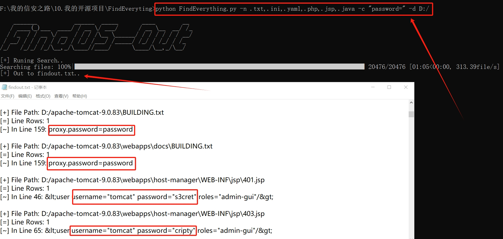

## ✈️ 工具概述

当对内网束手无策的时候，入口机器上面说不定藏着突破口，翻找本地的文件和建立的网络连接就是手法

这里也提供一个文件内容敏感词的字典，需要可以自己去整理，如下:

```
jdbc:
user=
password=
key=
ssh-
ldap:
mysqli_connect
sk-
```

通过快速遍历机器文件，去寻找这些关键词，可以找到突破口，这个代码我之前也分享给好几个朋友，在实战阶段效果不错，具体可以看公众号文章：[内网渗透信息搜集骚姿势](https://mp.weixin.qq.com/s/GkK4AgXsqng6OLAGs45MUg)

## 🚨 项目优势

**有其他敏感文件搜索工具，这个项目的优势在哪？**

- Linux基本都自带 `Python2/Python3` 环境，可以直接用来跑脚本
- 本项目没有使用到额外的pip库，运行 `.py` 脚本不需要执行额外的动作
- 其他项目基本需要编译成可执行文件使用（比如采用 `go` 语言编写的项目），如果编译后的文件不兼容或者无法执行就寄了
- 原理简单，输出文件方便清晰更加直观，有时最简单的就是最稳定的
- 可自定义性强，可以自由指定文件后缀名、搜寻内容以及搜寻目录

## 🐉 工具使用



Python3环境

```
python3 FindEverything.py -n .txt,.ini,.yaml,.php,.jsp,.java,.xml,.sql -c "password=" -d D:/
python3 FindEverything.py -n .txt,.ini,.yaml,.php,.jsp,.java,.xml,.sql -c jdbc:mysql
python3 FindEverything.py -n .txt,.ini,.yaml,.php,.jsp,.java,.xml,.sql -c jdbc:mysql -o output.txt
```

Python2环境

```
python2 FindEverything-py2.py -n .txt,.ini,.yaml,.php,.jsp,.java,.xml,.sql -c "password=" -d D:/
python2 FindEverything-py2.py -n .txt,.ini,.yaml,.php,.jsp,.java,.xml,.sql -c jdbc:mysql
python2 FindEverything-py2.py -n .txt,.ini,.yaml,.php,.jsp,.java,.xml,.sql -c jdbc:mysql -o output.txt
```

## 🙏 感谢各位师傅

[](https://star-history.com/#AabyssZG/FindEverything&Date)
